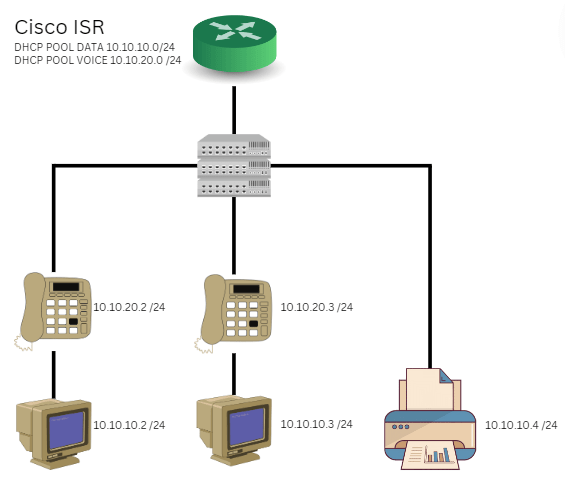
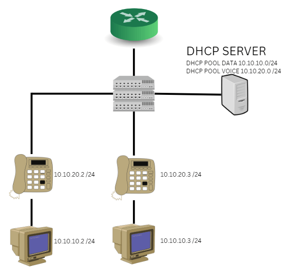
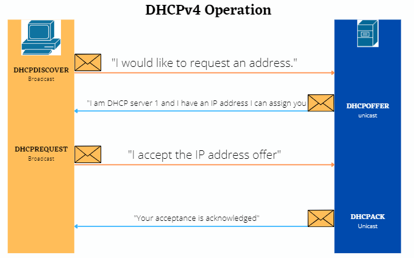
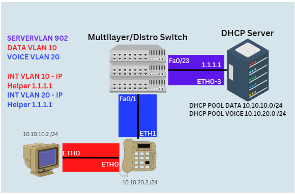

# DHCP Overview

- The Dynamic Host Control Protocol is used to dynamically allocate IPv4 addresses to end devices in your network.

- DHCP can also be used for a variety of different reasons within the enterprise to include PXE, TFTP services, SCCM, DNS allocation, and lease times.

- DHCP can be configured within the Cicso iOS or as a service on a Windows Server.

- DHCP uses a process called **"DORA"** to communicate with endpoints to delegate IP addressing or other **"DHCP Options"**
    - D - Discover (broadcast | UDP)
    - O - Offer (Unicast | UDP)
    - R - Request (Broadcast | UDP)
    - A - Acknowledgement (Unicast | UDP)

- DHCPv4 messages are encapsulated within the UDP transport protocol.

- DHCPv4 messages sent from the client use UDP source port 68 and destination port 67.
 
- DHCPv4 messages sent from the server to the client use UDP source port 67 and destination port 68.

## DHCP Relay

- In networking sometimes the best design for your campus/enterprise network is too have the DHCP server be a single service running on a VM, or a cluster of VMs.

- For endpoints logically segmented by VLANs and in their broadcast domains, the default-gateway interface will need to be configured with an **"IP Helper-address"** in order for endpoints to reach the DHCP server, **IF** the DHCP server is not within the same subnet/broadcast domain.

- The IP helper-address will redirect **"broadcast"** messages into **"unicast"** messages to be sent to the IP Helper-addresses destination IP address.

## VRF Support

- DHCP Pools can also be configured on Cisco iOS to support users in a Virtual Routing Forwarding Instance.

- VRFs creates a separate logical routing table that is not a part of the global routing table. (much like a VM and the host OS)

## DHCP Exclusions

- In the enterprise some endpoints you do not want to dynamically assign IP addressses. 

- Any endpoint device that has a URL/DNS record associated with it should be static.

- Printers, share drives and VTCs should also be considered for static IP addressing.
 
- In Cisco iOS and Windows DHCP Service you can set **"DHCP Exclusions"** that will not allow an IP address in the subnet to dynamically allocated.