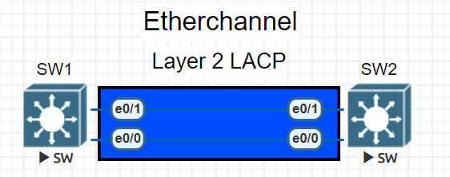
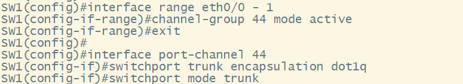
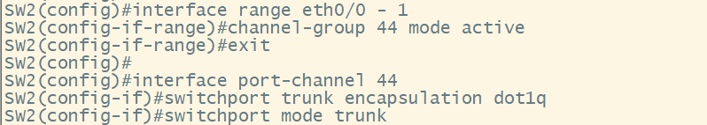
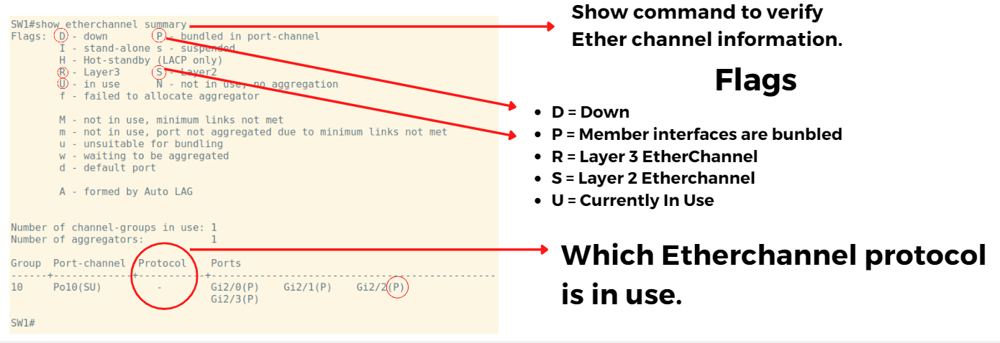

# Etherchannel LACP Configuration

### In this How To we will cover how to configure LACP for a Layer 2 Etherchannel on Cisco Catalyst switches.

- We will need to first bundle our interfaces into a port-channel

## Configuration

- First we must go into global configuration mode, and place our interfaces into a "**Channel-group**"

`SW1#configure terminal` # This command puts us in Global Config mode

`SW1(config)#interface range eth0/0 - 1` # This command will put you into the interface sub-configuration mode for multiple interfaces

`SW1(config-if-range)#channel-group 44 mode active` # This command will bundle the member interfaces into a port-channel using **LACP** negotiation to actively negotiate with the other side.

`SW1(config)#interface port-channel 44` # This command will put us into the port-channel sub-configuration mode

### All configuration should now be configured under the port-channel. The port-channel will then push the configuration down to the member interfaces.

`SW1(config-if)switchport trunk encapsulation dot1q` # This command will set the trunk to use the IEEE **802.1q** Encapsulation standard

`SW1(config-if)#switchport mode trunk` # This command will statically set the interface to **trunkning** mode.

- The complete configuration for both switches is shown below

## Verification

- The following show commands will verify if the etherchannel is working properly.

`SW1#show etherchannel summary` # This command will show us if our Etherchannel is bundled and active.

