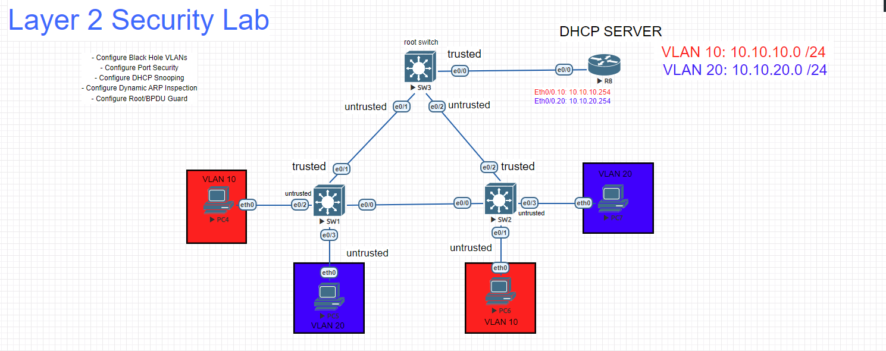
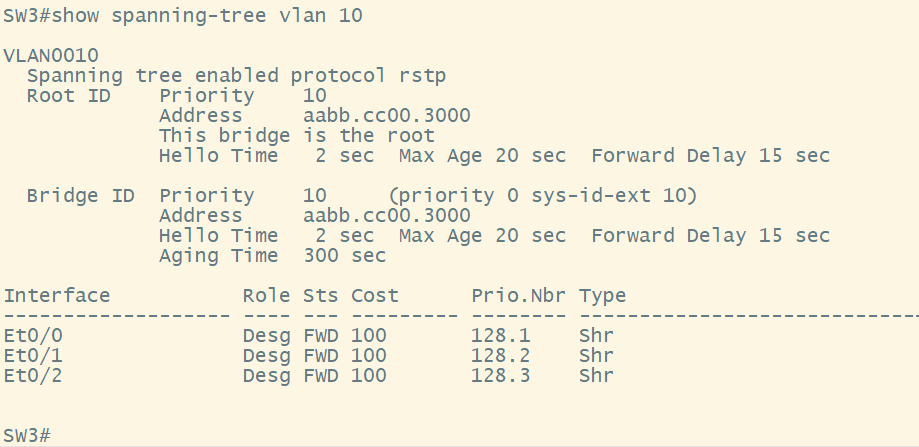
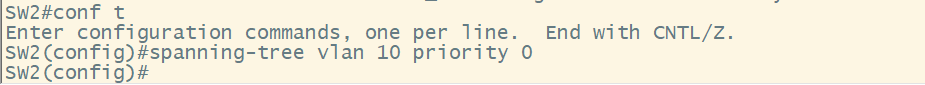
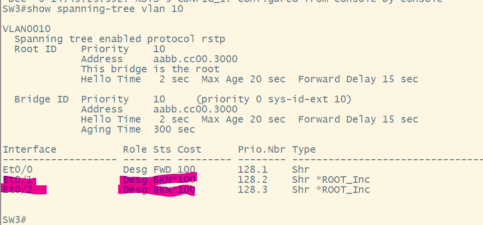
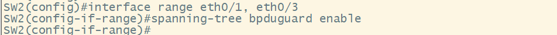
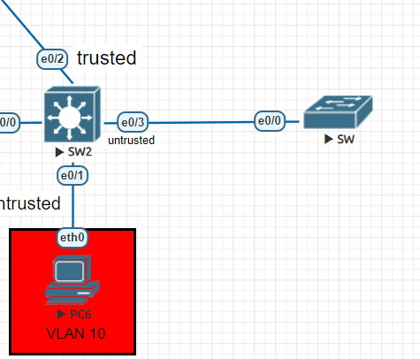
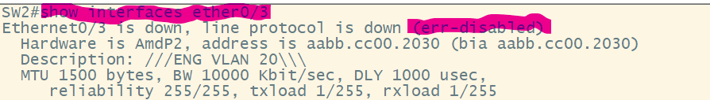
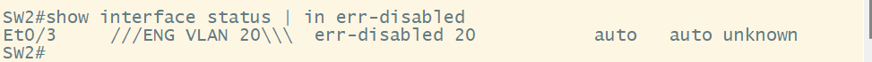

# BPDUGuard and Root Guard 

### - The spanning-tree protocol is a Layer 2 Control plane protocol that prevents switching loops by electing a root bridge and placing switchport into a Forwarding or blocking state. Cisco switches will send Bridge Protocol Datagram Units per VLAN to elect a root switch, which all other switches will forward traffic too.

### - STP is also vulnerable to Layer 2 attacks like Superior BDPU's, and malicious users creating a broadcast storm by flooding the switched architecture with BPDU's. 

### - Rootguard will prevent the manipulation of root bridge elections by placing protecting the root bridge from receiving superior BPDU's. 

### - For this How To we will configure rootguard on the root switches trunk ports. 

`SW3(config)#interface range eth0/1 - 2` # This command brings you into the sub-configuration mode for a range of interfaces.

`SW3(config-if-range)#spanning-tree guard root` # This command will place a designated port on the root bridge into a "blocking" state

### - Verification. Now lets see what happens to our topology once we apply rootguard and attempt to send a superior BPDU to SW3

### - As you can see here SW3 is the rootbridge for VLAN. We have already configured rootguard. Now lets go to SW2 and try to make it the rootbridge and check what happens on SW3

### - As you can see now the two interfaces facing the other switches are in a blocking state. This is because SW2 tried to send a **"superior BPDU"** to SW3 from SW1 and from itself.

# BPDUGuard

### BPDUGuard is a feature we apply to our access ports to prevent the interfaces facing our users from processing BPDUs. This protects our switched architecture from BPDUs being flooded into the network.

`SW2(config)#interface range eth0/1, eth0/3` # This command brings you into the sub-configuration mode for a range of interfaces.

`SW2(config-if-range)#spanning-tree bpduguard enable` # This command will place a port into an **"err-disabled"** state if the port receives a BPDU

### The full configuration is shown below

### Verification. Now let's attach a switch to the access ports and see how they respond. As we can see below with a switch connected and sending BPDU's the access port goes into a **"err-disabled"** state.

