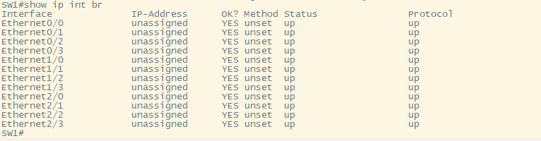

# Blackhole VLAN Configuration

### For this How To we will configure a **"Black Hole"** VLAN. The purpose of a blackhole VLAN is to ensure that any unused and open ports are configured with a VLAN TAG/ID that does not have any network access. This means the **"Black Hole"** VLAN is not a part of any broadcast domain or subnet.

- First we must configure the network for basic reachability. This How To assumes you already know how to configure and assign VLANs, trunks, SVIs, DHCP(Our DHCP server is a router), and DHCP relay.

- Next comes the simple configuration of a blackhole VLAN. All we do here is configure a VLAN ID that has a random number we will not use in production, and then assign that VLAN to all unused ports.

`SW1(config)#interface range eth0/4 - 11` # This command brings into the sub-configuration mode for a range of interfaces

`SW1(config-if-range)#switchport mode access` # This sets the switchport to access mode

`SW1(config-if-range)# switchport access vlan 888` # This sets the access VLAN to be used on the port

### Now we must prune the **"Black Hole"** VLAN on all our trunk ports.

`SW1(config-if-range)#switchport trunk allowed vlan except 888` # This command will allow all VLANs across the trunk except for the VLAN specified.

### The full configuration is shown below.

### Below is a picture of all the ports on our switches we are using for demonstration.

