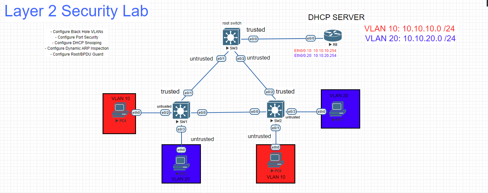
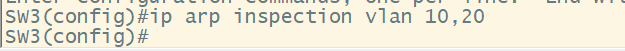

# Dynamic ARP Inspection

### - The Address Resolution protocol is used to map Layer 3 to Layer 2 addresses in our networks. Endpoints and network devices will have a ARP Cache/Table for those mappings. In our networks someone malicious could spoof ARP replies and perform MITM attacks. this is called **"ARP Spoofing"**, we can authenticate ARP packets by implementing DAI (Dynamic ARP Inspection).

### - DAI in a DHCP environment will rely on the DHCP snooping binding database table to authenticate the Layer 3 - Layer 2 mappings in ARP requests and replies.

### - For this How to we will first need to get our network ready by configuring VLANs, Trunks and DHCP snooping. If you do not know how to configure these technologies please refer to our other How To's. To configure DAI follow the configuration below.

`SW3(config)#ip arp inspection vlan 10,20` # This command will enable ARP inspection for the specified VLANs. DAI will authenticate the Layer 2 and Layer 3 mappings for devices in your network to prevent spoofing.

### Verification. Now that we have enabled DAI on all our switches lets clear the arp cache in our DHCP server and resend the DHCP request from our clients.

`R1#clear arp` # This command will clear the ARP table in our Cisco iOS router.

### Here we can see an error message for our DHCP server. This is because the DHCP server is a static address and is not in our DHCP snooping binding table. We can fix this issue with an **"ARP ACL"** or by configuring the **"ARP Trust"** command on interfaces facing the DHCP server.

`SW3(config)#interface eth0/0` # Brings you into the interface subconfiguration mode

`SW3(config-if)#ip arp inspection trust` # This command allows ARP packets to be authenticated without the L2-L3 mappings being in the DHCP snooping table

`SW2(config)#arp access-list DAI` # This command creates an ACL specifically for ARP packets

`SW2(config-arp-acl)#permit ip host 10.10.10.254 host aabb.cc00.8000` # This command permits a specific host on the ARP ACL

`SW2(config-arp-acl)#permit ip host 10.10.20.254 host aabb.cc00.8000` # This command permits a specific host on the ARP ACL

`SW2(config)#ip arp inspection filter DAI vlan 10,20` # This command will apply the the ARP ACL for the specified VLANs.

### Full configuration below

### Show commands

