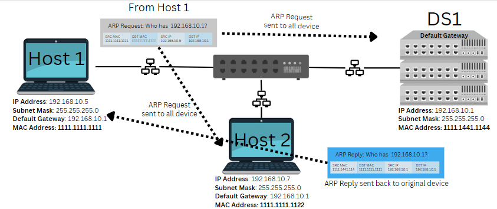
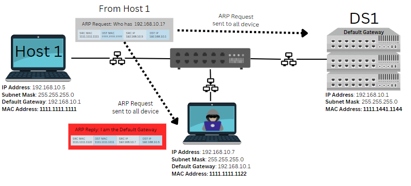

# Layer 2 Security

### - Securing our Layer 2 Infrastructure is a very important component when designing and configuring LANs and the Campus Network. As network administratos/Engineers we must secure the control plane and data plane of our Switched network. Mitigating threats and malicious actors should be apart of the baseline for our Layer 2 infrastructure

### - To ensure we take a Defense in Depth approach we must implement logical controls on our Network devices, this is the role we play as networking professionals.

### - There are many technologies we can implement on our switches. Control plane policing and protection, DHCP Snooping, Dynamic ARP inspection, Private VLANs, Storm Control, BPDU Guard and STP security, VACLS, Port Security, and NAC. These are some of the most common protections we can implement via CLI to the Cisco iOS to protect our switched campus networks.

# DHCP Snooping

### DHCP Snooping protects our switched architecture from rogue DHCP servers that are performing MITM attackers to assign a malicious default gateway or DNS server IP's to clients.

- DHCP Snooping is configured on our access and distribution switches in a Cisco 3-Tier topology. The goal of DHCP snooping is to authenticate which interfaces should accept DHCP messages and which shouldnt. DHCP snooping uses **"trusted"** and **'untrusted'** ports to ensure no rogue DHCP servers can be used to allocate IP addresssing to our clients.

- DHCP server messages (DHCPOffer, DHCPAck) will only be accepted on the configured **"Trusted"** ports. 

- DHCP client messages (DHCPDiscover, DHCPRequest) will only be accpeted on the configured **"untrusted"** ports. If a rogue DHCP service is running on a clients computer, and the service tries to send a DHCPOffer or DHCPAck message, the switchport or VLAN which is configured as untrusted will drop that traffic.

- Successful Client-DHCP server exchanges will populate what is called the **"DHCP Snooping Binding Table"**. This table will contain all the current DHCP leases that were authenticated via DHCP snooping.

# ARP Spoofing

### The address resolution protocol is used to map Layer 3 to Layer 2 information so endpoints have reachability to the default gateway. Endpoints and Network devices will store this mapping information in their **"ARP Table"**. When a device is statically set, or dynamically an IP address that device knows the IP address of the Default Gateway, but does not know the MAC address. An ARP request/packet is used to discover the MAC address of the default gateway. ARP spoofing is when a rogue device claims to have the Default Gateway's MAC address by responding to that ARP request. When a rogue device does this the client will send all traffic to that rogue device. Essentially performing a MITM attack.

- An ARP spoofing attack is easy to perform if there is no way to authenticate which ARP packets are not malicious. Only the true default gateway should respond to an ARP request from a user looking for the Default Gateway.

- Dynamic ARP inspection enables a switch to verify which device on the network is allowed to respond to an ARP request. DAI (Dynamic ARP inspection) builds a table that is based of the DHCP snooping table and will drop any ARP frames with L2-L3 mappings not matching an entry in the DAI table. 

# BPDUGuard and STP 

### The spanning-tree protocol is a control plane protocol which prevents switching loops by electing a **"switch"** and setting ports in the non-root switches as either forwarding or discarding. STP uses Bridge Protcol Datagram Units to perform the STP Root election. These BPDU's can be manipulated to perform Layer 2 attacks like a **"Root Bridge Takeover"** which is done by sending **"superior"** BPDU's, or a BPDU DoS attack. 

- Superior BDPU's can be sent from a user workstation to manipulate the STP election in the switched network. BPDU's are meant to only be sent between switches and trunk ports to stop a broadcast storm and switching loop in the Layer 2 Architecture. However, by default BPDU's are sent out all active switchports. This allows users to downloand software onto their workstation to send **"Superior BPDU's"** through the network.

- Rootguard is a feature which can prevent a **"Root Bridge Takeover"** attack. Root Guard will prevent a port from transitioning to the **"root"** port. This **"root"** forwards frames towards the root switch. So essentially if a switch is the current root bridge, and an interface receives a Superior BPDU, root guard will prevent the interface from transitioning to forward to a new root bridge.

- BPDU DoS is a BPDU flooding attack performed from a users work station. When BPDU's are sent through the switched network they generate **"TCNs"** (Topology Change Notifications).These control plane messages require CPU calcuation from the switches CPU; so when a user can maliciously manipulate how many TCN's are performed through the switched network they create a DoS attack using BPDUs.

- BPDUGuard will prevent against BDPU Flooding attacks by placing any ports configured with BPDUGuard into an **"err-disabled"** mode when the port recieves a BPDU.

# Port Security

### Implementing **switchport port-security** on the access interfaces of switches protects us from rogue devices, and endpoint attempting to perform a CAM flooding attack.

- Switches make forwarding decisions based off destination MAC addresses. The CAM table (MAC Address table), is the forwarding table that a switch will referrence to forward frames. Switches do have a limited amount of CPU and space available for the CAM table. 

- Malicious Users can exploit the limited resources of a switch by flooding the switch with fake MAC addresses. This can easily be done with software from a users computer. A CAM flooding attack is essentially a denial of service attack against the switch.

- To protect against this attack and also rogue devices, like a COTS WAP from being plugged in, we can configure **port-security** to limit the amount of MAC addresses allowed per interface. Port-security can shutdown or place a port into **"err-disabled"** mode to prevent CAM flooding or rogue devices.

- Port security has three different modes that you can configure per port. The default mode is **"shutdown"**, which will place the port into an **"err-disabled"** mode and shutdown the interface.

