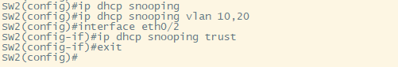
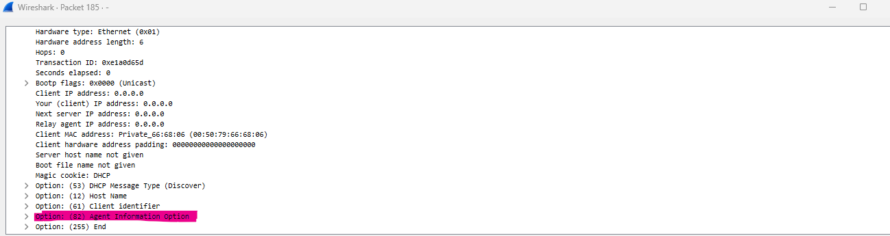
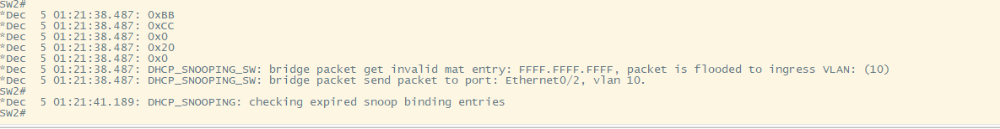
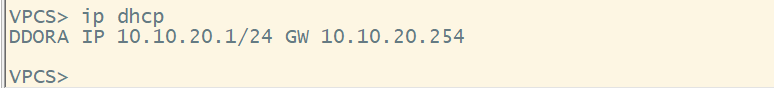
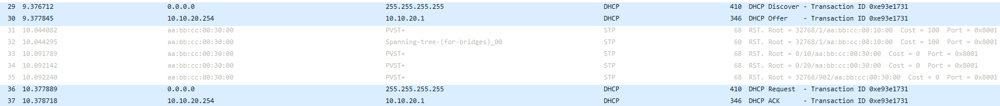
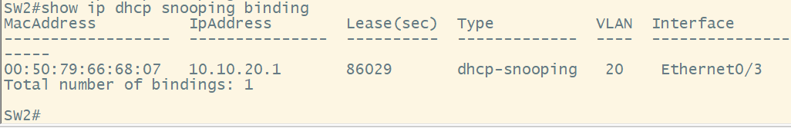

# DHCP Snooping Configuration

### In this How To we will cover how to configure DHCP Snooping with the L3 device in our network as the DHCP server. First thing we will have to do is configure the baselines for all devices. SW1, SW2, and SW3 will have VLANs 10,20 created, and all trunks links configured. The Router will have a DHCP pool configured and sub-interfaces.

### This How To assumes you already know how to configure these technologies. If you do not know how to configure refer to the other How To's.

### First we will have to determine the **"trusted"** and **"untrusted"** interfaces in the network. **"trusted"** ports will be the links that are receiving the DHCP server messages. [SW2--Eth0/2], [SW3--Eth0/0], [SW1--Eth0/1]. The **"untrusted"** ports will be all the ports that receive incoming DHCP client messages. Now let's start are basic configuration.

`SW1(config)#ip dhcp snooping` # This command will enable **"DHCP Snooping"** globally on our switch

`SW1(config)#ip dhcp snooping vlan 10,20` # This command will enable DHCP snooping to be enabled for the specified VLANs.

`SW1(config)#interface eth0/2` # This command will bring us into the sub-configuration mode for the interface we want to configure

`SW1(config-if)#ip dhcp snooping trusted` # This command will specify the interfaces that can receive incoming DHCP server messages. *** ***IMPORTANT NOTE*** *** The trusted interfaces will add DHCP option 82 to onto the DHCPDiscover message. This option will cause DHCP relay's to drop the DHCP packet. 

### The full configuration is shown below.

### Now let's try to pull a DHCP address. We will show a wireshark capture and a debug message from SW2 that shows the packet being dropped because of the DHCP option 82 being inserted. 

`SW2#debug ip dhcp snooping packets` # This debug command will show us the steps of the DHCP snooping process.

### Although output is limited essentially what is happening here is the DHCP packet is getting dropped before it even makes it to the DHCP server. Because at the next hop at SW3 that 82 option will make the switch believe it is a relay message, which it is not. It is a DHCP broadcast message. To fix we must a command to both our switches and a command for our router.

`SW2(config)#no ip dhcp snooping information option` # This command will stop the DHCP option 82 from being inserted onto the DHCP packet.

`R1(config)#ip dhcp relay information trust-all` # By default, if the gateway address is set to all zeros in the DHCP packet and the relay agent information option is already present in the packet, the DHCP relay agent will discard the packet. Use the ip dhcp relay information trust-all command to override this behavior and accept the packets.

### with these two commands configured we will now be able to receive an IP address via DHCP.

### Below we have our PC completing the DORA process, and then a packet capture of the link between SW3 and the DHCP server. And also our DHCP snooping verification command.

