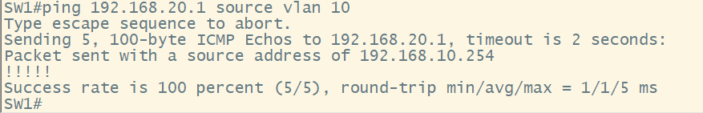

# Creating SVIs

## In this How To we will cover creating an SVI on a Distro switch and using the SVI as the default gateway for our users.

- For this **How To** we will need to create two **SVIs** for VLAN 10, and VLAN 20. It already assumed that you have created VLANs and assigned them to the correct interface.

## Configuration

`SW1#configure terminal` # This command puts us in Global Config mode

`SW1(config)#interface vlan 10` # This command will create our logical Switched Virtual Interface, and put us into the SVI sub-configuration mode

`SW1(config-if)#description SALES VLAN 10 DEFAULT GATEWAY` # This command will give a description for the interface

`SW1(config-if)#ip address 192.168.10.254 255.255.255.0` # This command will assign an IP address to the interface

`SW1(config-if)#no shut` # This command will turn on the interface and put it into an **"up"** state.

- The full configuration for SW1 is shown below 

## Testing

- Not seen is assigning the IP addresses to the computers. But in this demonstration we can see the computers on different VLANs have IP reach-ability.

- This wireshark capture shows the ping test between the subnets.

## Verification

- The following show commands verify that the SVI's are created and that they are in a UP/UP state.

`SW1#show ip interface brief | include Vlan` # The initial command will show a brief output of all the interfaces on the device. The "pipe" command uses REGEX to filter the output to just the SVI's

