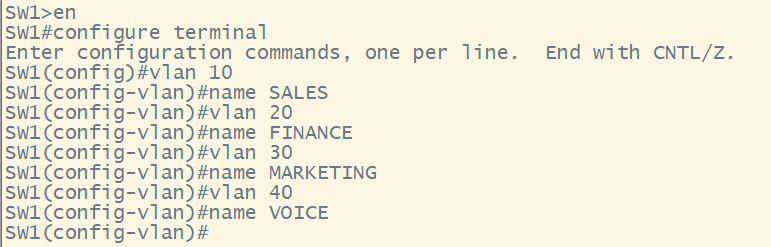
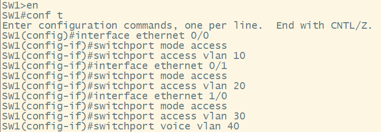
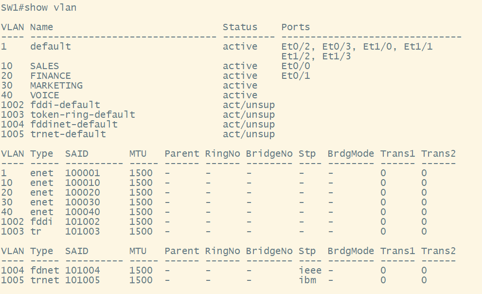
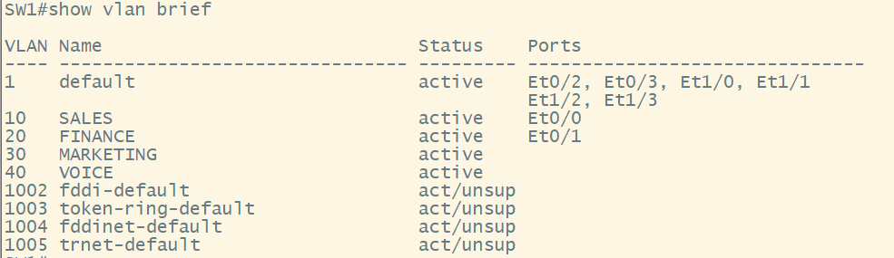
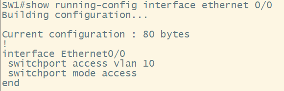
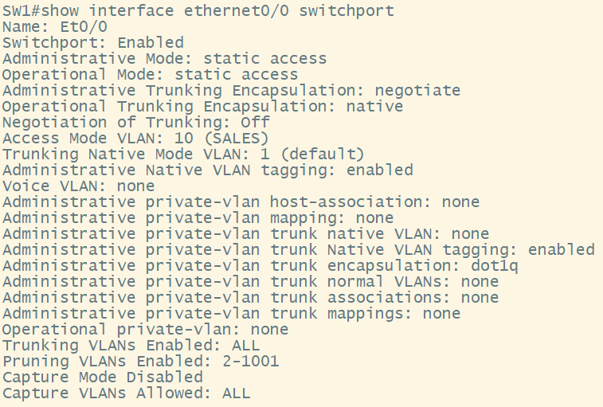

# Creating and Assigning VLANs

### In this How To we will cover creating an Access and Voice VLAN and assigning VLANs to a switchport.

- We will have to create 4 VLANs on each switch and will assign the VLANs to the correct ports.

## Configuration 

- To create VLANs we must go into Global Configuration mode on the CLI, and then create the VLANs using the syntax below.

`SW1#configure terminal` # This command puts us in Global Config mode

`SW1(config)#vlan 10` # This command puts us into the VLAN sub-configuration mode

`SW1(config-vlan)#name SALES` # This command sets a name for the VLAN.

`SW1(config-vlan)#exit` # This command will actually save the VLAN into the VLAN database

- The complete configuration to create all four VLANs is shown below. 

- Now that we have created the VLANs we will need to assign the VLANs to the correct ports. We assign VLANs from Global Configuration Mode using the syntax below.

`SW1(config)#interface ethernet 1/0` # This command puts us into the interface sub-configuration mode

`SW1(config-if)#switchport mode access` # This command sets this interface to actually be an **"access"** port for users.

`SW1(config-if)#switchport access vlan 30` # This command will actually assign **VLAN** **30** to this interface

`SW1(config-if)#switchport voice vlan 40` # This command will set a **VOICE** **VLAN** for the interface

- The complete configuraion to assign all VLANs is shown below. 

## Verification

- The following show commands will verify that the VLANs are created and are assigned to the correct port.

`SW1#show vlan` # This command will show the entire VLAN database 

`SW1#show vlan brief` # This command will show only a brief output of the VLAN database 

`SW1#show running-config interface ethernet 0/0` # This command will show you the configuration for just the specified port 

`SW1#show interface ethernet 0/0 switchport` # This command will show how the hardware of the port is actually configured. Whether its Layer 2 and what mode the port is configured for. 
 